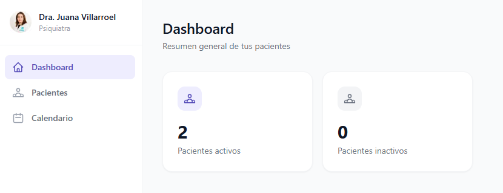
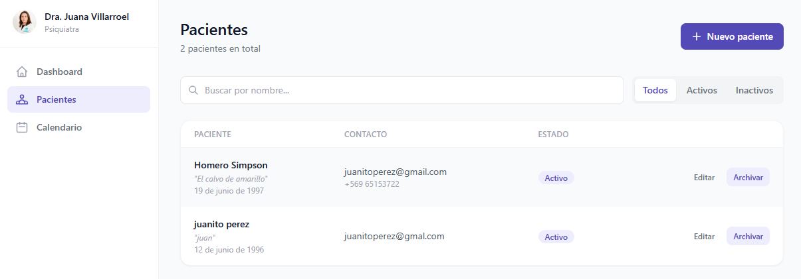
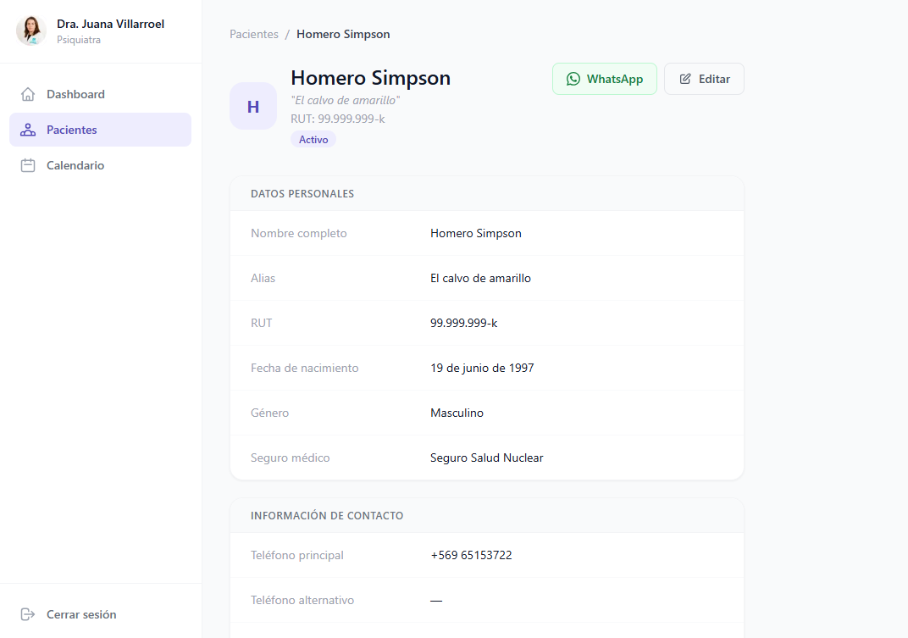
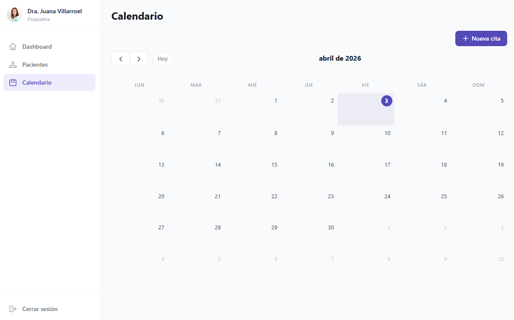

# CRM Clínica — Sistema de Gestión para Profesionales de la Salud

Sistema web de gestión clínica diseñado para profesionales de salud independientes (psiquiatras, psicólogos, médicos y similares). Permite administrar la ficha completa de cada paciente, visualizar y gestionar citas en un calendario interactivo, y sincronizar reservas automáticamente desde Cal.com. El objetivo es centralizar toda la información del consultorio en un solo lugar, accesible desde cualquier dispositivo.

---

## 📸 Screenshots

**Dashboard**


**Gestión de pacientes**


**Ficha de paciente**


**Calendario de citas**


---

## Funcionalidades principales

- **Autenticación segura** — Inicio de sesión con email y contraseña. Las rutas del dashboard están protegidas y redirigen al login si no hay sesión activa.

- **Dashboard con métricas** — Vista resumen que muestra el total de pacientes activos e inactivos del consultorio. (por mejorar)

- **Gestión completa de pacientes** — Crear, editar, ver y eliminar fichas de pacientes con información personal, de contacto, contacto de emergencia y datos administrativos del consultorio. El expediente del paciente no se considera en esta informacion actualmente, solo una referencia del N° de Expediente, nada mas.

- **Ficha clínica detallada** — Cada paciente tiene una ficha con: nombre, alias, RUT, fecha de nacimiento, género, seguro médico, teléfonos, correo, dirección, contacto de emergencia, número de expediente físico, canal de llegada y notas generales.

- **Acceso rápido a WhatsApp** — Desde la ficha de cada paciente, botón directo para abrir una conversación de WhatsApp con su número registrado.

- **Estado de paciente** — Cada paciente puede marcarse como Activo o Inactivo para filtrar la lista de trabajo. Los pacientes inactivos son los que se dieron de alta o no volvieron a consultar.

- **Calendario mensual interactivo** — Visualización de todas las citas en un calendario tipo Google Calendar, con navegación por mes.

- **Creación manual de citas** — El usuario puede agendar citas directamente desde el CRM, seleccionando paciente, fecha, hora y duración. La fecha se puede preseleccionar clickeando el dia en el que se quiere crear la cita.

- **Eliminación de citas con confirmación** — Las citas pueden eliminarse desde el detalle del panel lateral, con un modal de doble confirmación para evitar borrados accidentales.

- **Sincronización automática con Cal.com** — Las reservas realizadas por pacientes a través de Cal.com se registran automáticamente en el sistema mediante un webhook. Si el paciente no existe, se crea automáticamente segun si esque el mail que se uso para registrar la cita ya existia o no en la tabla de clientes.

- **Soporte para videollamadas** — Las citas originadas desde Cal.com que incluyen Google Meet muestran el enlace directo para unirse a la reunión.

- **Diseño responsive** — Interfaz adaptada para escritorio y móvil, con barra inferior en dispositivos pequeños y barra lateral en pantallas grandes. (la barra en donde dice dashboard, pacientes y calendario)

- **Personalización por cliente** — El nombre del consultorio, especialidad, logo y colores de marca son configurables por variables de entorno, sin tocar el código.

---

## 🛠️ Stack tecnológico

### Frontend
| Tecnología | Versión | Uso |
|---|---|---|
| Next.js | 14.2.35 | Framework principal (App Router, SSR/SSG) |
| React | ^18 | UI y manejo de estado |
| TypeScript | ^5 | Tipado estático |
| Tailwind CSS | ^3.4.1 | Estilos y diseño responsive |
| FullCalendar | ^6.1.20 | Componente de calendario interactivo |

### Backend / BaaS
| Tecnología | Versión | Uso |
|---|---|---|
| Supabase | ^2.100.1 | Base de datos, autenticación y Realtime |
| Supabase SSR | ^0.5.1 | Integración con Next.js App Router |
| Deno (Edge Functions) | — | Runtime para el webhook de Cal.com |

### Base de datos
- **PostgreSQL** (gestionado por Supabase) con Row Level Security (RLS) habilitado en todas las tablas.

### Integraciones externas
- **Cal.com** — Plataforma de agendamiento online. Se integra mediante un webhook que dispara eventos `BOOKING_CREATED`, `BOOKING_CANCELLED` y `BOOKING_RESCHEDULED`.
- **WhatsApp** — Enlace directo `wa.me` desde la ficha del paciente (sin API oficial, solo redirección).

---

## Instalación y uso local

### Requisitos previos

- [Node.js](https://nodejs.org/) v18 o superior
- [npm](https://www.npmjs.com/) v9 o superior (incluido con Node.js)
- Una cuenta en [Supabase](https://supabase.com/) con un proyecto creado
- (Opcional) Una cuenta en [Cal.com](https://cal.com/) para la sincronización de reservas

### 1. Clonar el repositorio

```bash
git clone https://github.com/Decinti/crm_psiquiatra.git
cd crm_psiquiatra
```

### 2. Instalar dependencias

```bash
npm install
```

### 3. Configurar variables de entorno

Copia el archivo de ejemplo y completa los valores:

```bash
cp .env.example .env.local
```

Edita `.env.local` con los datos de tu proyecto Supabase (ver sección [Variables de entorno](#-variables-de-entorno)).

### 4. Configurar la base de datos en Supabase

En el **SQL Editor** de tu proyecto Supabase, ejecuta el contenido del archivo:

```bash
supabase/schema.sql
```

Esto creará las tablas `pacientes` y `citas`, los triggers de `updated_at` y todas las políticas de Row Level Security.

### 5. Crear un usuario de acceso

En **Supabase Dashboard → Authentication → Users**, crea un usuario con email y contraseña. Ese será el acceso al CRM.

### 6. Ejecutar el proyecto en desarrollo

```bash
npm run dev
```

Abre [http://localhost:3000](http://localhost:3000) en tu navegador.

### 7. (Opcional) Configurar el webhook de Cal.com

Para sincronizar reservas desde Cal.com, despliega la Edge Function incluida en `supabase/functions/cal-webhook/` y configura la URL como webhook en tu cuenta de Cal.com apuntando al endpoint de Supabase.

---

## ⚙️ Variables de entorno

Crea un archivo `.env.local` en la raíz del proyecto con las siguientes variables:

```env
# ── Identidad del consultorio ──────────────────────────────────────────
# Nombre que aparece en el login y la interfaz
NEXT_PUBLIC_CLIENT_NAME="Nombre del profesional o consultorio"

# Especialidad que se muestra como subtítulo en el login
NEXT_PUBLIC_CLIENT_SPECIALTY="Ej: Psiquiatría, Psicología Clínica"

# Ruta al logo (relativa a la carpeta /public)
NEXT_PUBLIC_CLIENT_LOGO="/logo.png"

# ── Colores de marca (formato hexadecimal) ─────────────────────────────
# Color principal: botones, acentos, elementos activos
NEXT_PUBLIC_COLOR_PRIMARY="#534AB7"

# Color secundario: fondos suaves, badges, avatares
NEXT_PUBLIC_COLOR_SECONDARY="#EEEDFE"

# ── Supabase ───────────────────────────────────────────────────────────
# URL pública del proyecto Supabase (visible en Project Settings → API)
NEXT_PUBLIC_SUPABASE_URL=https://xxxxxxxxxxxx.supabase.co

# Clave anon/public de Supabase (usada en el cliente y el servidor con RLS)
NEXT_PUBLIC_SUPABASE_ANON_KEY=eyJ...

# Clave service_role de Supabase (solo para el webhook de Cal.com — nunca exponerla al cliente)
SUPABASE_SERVICE_ROLE_KEY=eyJ...
```

> **Importante:** Las variables con prefijo `NEXT_PUBLIC_` son visibles en el navegador. Nunca coloques la `SUPABASE_SERVICE_ROLE_KEY` con ese prefijo.

---

## 👤 Autor y contacto

**Autor:** Bruno Alonso Decinti Villarroel
**LinkedIn:** https://www.linkedin.com/in/bruno-decinti-507a762a8/
**Email:** brunodecinti2013@gmail.com
